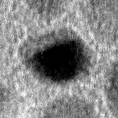

# Nanoparticle Segmentation in Transmission Electron Microscopy (TEM) Images - Running

!!! abstract

    This project aims to develop a segmentation algorithm for identifying and analyzing individual nanoparticles in Transmission Electron Microscopy (TEM) images. The primary focus is on segmenting particles and extracting features such as major and minor axes for each particle in the images.

{ align=right }

## Project Overview

The project involves processing a dataset of 85 TEM images (150x150 pixels) organized in 3 subfolders. Each image represents a different sample of nanoparticles, and the goal is to automatically segment the nanoparticles and measure their dimensions.

### Key Features

- **Image Preprocessing:** Applying filters and enhancements to TEM images for noise reduction and contrast improvement.
- **Segmentation:** Utilizing image processing techniques to detect and isolate individual nanoparticles in each image.
- **Feature Extraction:** Calculating the major and minor axes for each segmented nanoparticle.

## Dataset

The dataset consists of 85 TEM images, split into 3 subfolders:
- Each image is 150x150 pixels in size.
- Files follow the naming convention: `{folderName}_{particleNumber}.jpg`.

